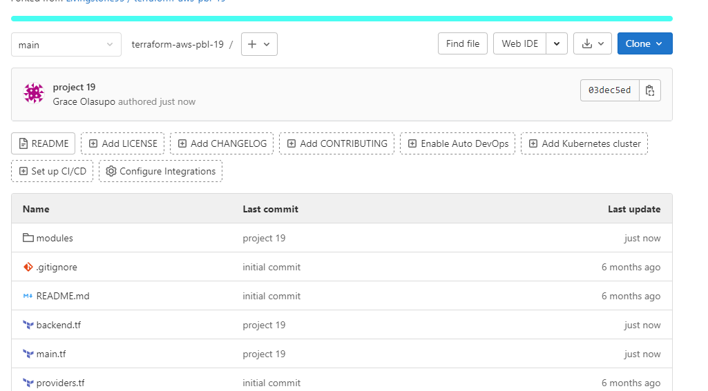
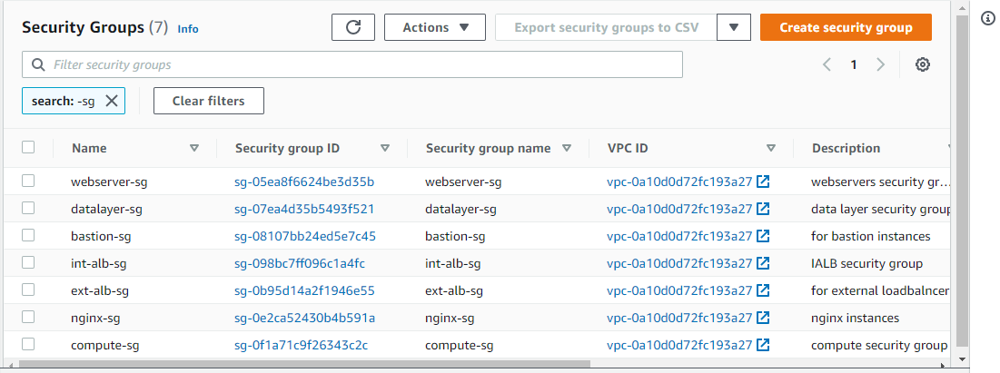
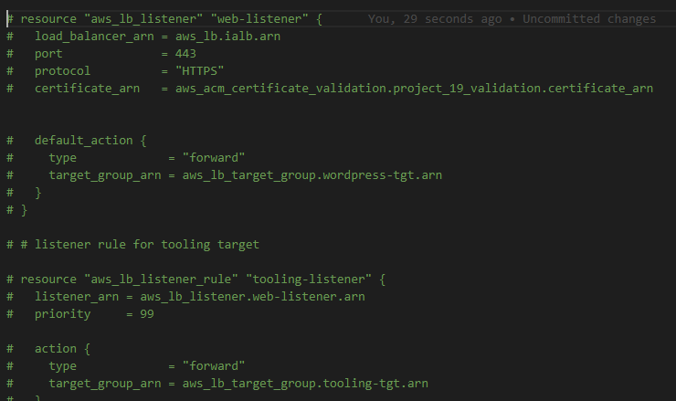
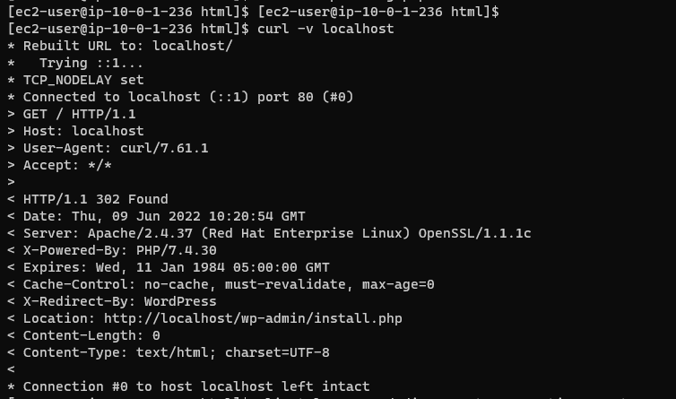

# Documentation of project19

## Step1
1. I installed packer 
   

2. I changed directory into my packer folder in my workspace
    
    

3. I ran `packer fmt` to format the files in my folder
     
     
    
4. Then I ran the build command for my bastion server

     `packer build bastion.pkr.hcl`

     
     

5. I ran the build command for nginx server as well
    
    `packer build nginx.pkr.hcl`

    
    

6. I also ran the build command for ubuntu server
    
    `packer build ubuntu.pkr.hcl`

    
    

7. I ran the build command for web server also

    `packer build web.pkr.hcl`

    
    
   

8. I confirmed the AMIs that were created on my aws console

   

9. I inserted the AMIs that were created in my 'terraform.auto.tfvars' file

     

10. I created a new terraform account and configured it

     
     

11. I made the necessary changes to my terraform folder then I pushed the changes to my gitlab repository
     
     
     

12. I started a plan and I applied it on my terraform console

     
     
     
     
     
     
     
     

13. I confirmed what terraform created on my aws console
     
     
     
     
     
     
     
     
     
     
     
     
     
     
     
     
     

14. I commented out the command for creating listeners, attaching external loadbalancer to autoscaling group 
    
    
    

15. I went to my terraform console to plan and apply the changes
     
     

## Step2

1. I logged into my bastion server

2. I configured aws

3. I exported the ansible-config path

4. I tried running the inventory command in my inventory directory at first but it wasn't successful
    
    

5. I troubleshooted and realized I didn't install boto3 and botocore properly si I did the needful
    
    

6. So I ran the ansible command again and it was successful
     
     

7. Then I ran the ansible-playbook command too and it was successful
     
     
     

# Step 3

1. I ssh into my nginx server through my bastion server

   

2. I ssh into my wordpress server through my bastion server

   

3. I checked if the server was running on my localhost
  
  
  

4. It didn't connect properly so I made some changes in "wp-config.php"
    
    

5. I ran the `curl -v localhost` command again and it worked

    

6. I ssh into tooling server through bastion server
    
    

7. I checked if the server was running perfectly on my localhost

    
    

8. I went to my Route53 and copied my wordpress link 
     
     

9. I opened the link on my incognito tab
     
     
     

10. I went to my Route53 zone and copied my tooling link

    
    
11. I opened the link on my browser

    

12. I opened my jenkins link on my browser too and it worked

    

13. I destroyed the infrastructure when I  finished what I was doing

    
